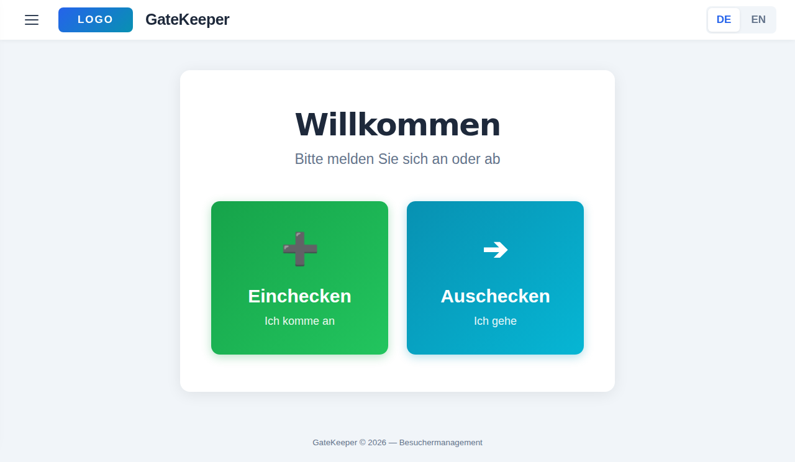
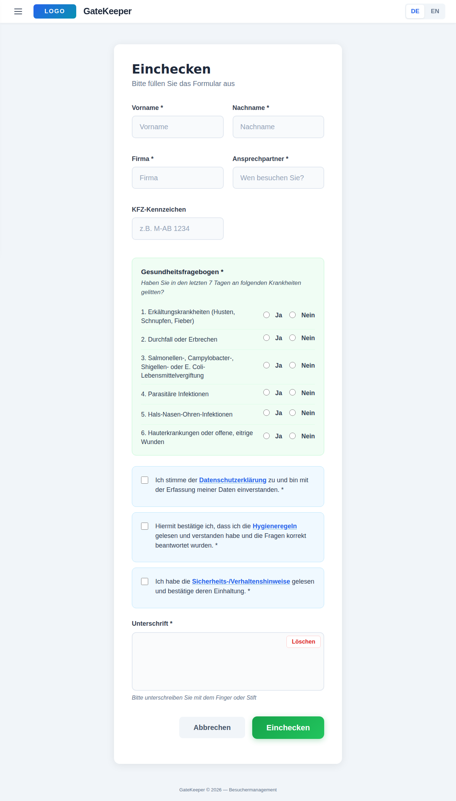
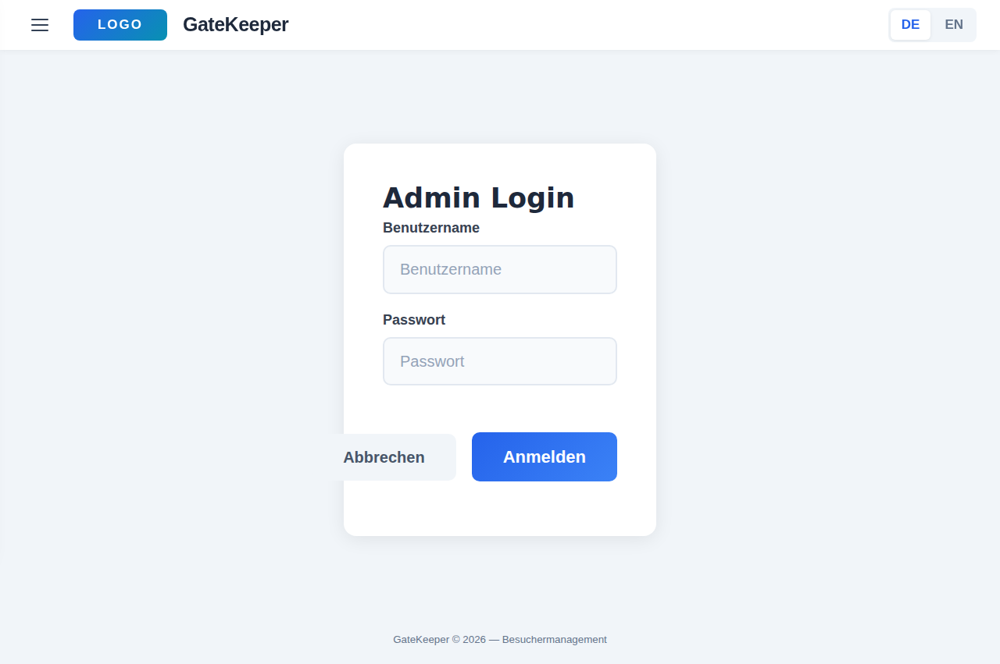
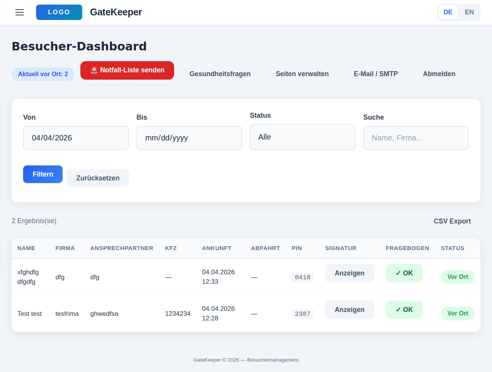

# 🏢 GateKeeper

> 🇩🇪 [Deutsche Version / German Version](README_DE.md)

**Modern, iPad-optimized visitor management system for company entrances. Visitors check themselves in and out, while a password-protected admin area provides full oversight.**


---

## 📸 Screenshots

| Home | Check-in | Admin Login | Admin Dashboard |
|------|----------|-------------|-----------------|
|  |  |  |  |

---

## ✨ Features

- **Self-service check-in** — First name, last name, company, contact person, license plate, digital signature, GDPR consent
- **Health questionnaire** — Dynamic yes/no questions, configurable in admin area (hygiene, infectious diseases)
- **Hygiene rules & safety instructions** — Linkable subpages with consent checkboxes
- **4-digit PIN** — Generated at check-in, used to check out when leaving
- **Touch-optimized signature field** — Finger / Apple Pencil support
- **Visual PIN numpad** — For check-out (no keyboard needed)
- **Side menu** — Emergency contacts, emergency plans, emergency numbers, visitor information, hygiene rules, safety instructions
- **Admin dashboard** (password-protected):
  - Visitor list with filters (date, status, free text search)
  - Display of signatures and questionnaire answers
  - CSV export (including questionnaire columns)
  - Edit static pages (emergency info, hygiene rules, safety instructions, etc.)
  - SMTP settings for automatic monthly visitor report by email
- **Monthly email report** — Visitor list as CSV attachment, automatically via cron or manually from admin area
- **Emergency evacuation list** — Send current visitor list immediately by email to emergency recipients
- **Bilingual** — German / English (switchable with one click)
- **GDPR compliant** — Consent checkbox, automatic data cleanup
- **iPad kiosk optimized** — Meta tags, touch-friendly UI, auto-redirect after actions

---

## ⚠️ Disclaimer

This project was developed with AI assistance ("vibe coding") and uses third-party open-source dependencies that have **not been independently audited**. The software is provided "as is" under the MIT License, without warranty of any kind.

**Please note:**
- This is a personal/hobby project, not a certified visitor management system
- The health questionnaire and safety instructions are **examples** — adapt them to your specific regulations
- Digital signatures stored as Base64 PNG — not legally equivalent to qualified electronic signatures in all jurisdictions
- External dependencies (Flask, SQLAlchemy, Pico CSS, etc.) are maintained by their respective projects
- Always test thoroughly before deploying in a production environment

> **Short version:** Test first, adapt the content to your needs, verify compliance with your local regulations.

---

## 🛠️ Tech Stack

| Component | Technology |
|-----------|------------|
| Backend | Python 3.11+ / Flask 3.x |
| Database | SQLite (file-based, no server needed) |
| ORM | SQLAlchemy + Flask-Migrate |
| Frontend | Pico CSS v2 + Vanilla JS |
| Auth | Flask-Login + Werkzeug Password Hashing |
| i18n | German / English (session-based) |
| Deployment | Apache + mod_wsgi or Gunicorn |

---

## 📋 Requirements

| Component | Version | Note |
|-----------|---------|------|
| **Python** | 3.11+ | Recommended: 3.12 |
| **pip** | latest | Or use [uv](https://docs.astral.sh/uv/) |

---

## 🚀 Installation

> **Note:** GateKeeper runs on Linux (Ubuntu 22.04+ / Debian 12+). Windows is not supported.

### Production Deployment (recommended)

One command installs everything — system packages, Apache, Python dependencies, database, cron jobs:

```bash
sudo apt update && sudo apt install -y git
git clone https://github.com/ichabot/GateKeeper.git /opt/gatekeeper
sudo bash /opt/gatekeeper/deploy/setup.sh
```

The app is then available at **http://your-server-ip** (port 80).

Alternatively, run the setup script directly without cloning first:

```bash
curl -sL https://raw.githubusercontent.com/ichabot/GateKeeper/main/deploy/setup.sh | sudo bash
```

### Development (local testing)

```bash
sudo apt install -y python3 python3-venv python3-pip git

git clone https://github.com/ichabot/GateKeeper.git
cd GateKeeper
python3 -m venv venv
source venv/bin/activate
pip install -r requirements.txt
cp .env.example .env
flask run
```

The dev server is then available at **http://localhost:5000** (local access only).

### Default Admin Access

| | |
|---|---|
| URL | `http://your-server-ip/admin/login` |
| Username | `admin` |
| Password | `admin` |

**Important:** Change the password after setup:

```bash
cd /opt/gatekeeper && source venv/bin/activate
flask seed-admin --username admin --password <new-password>
```

---

## 📁 Project Structure

```
GateKeeper/
├── app/
│   ├── __init__.py              # App Factory, CLI Commands, Seed Data
│   ├── extensions.py            # Flask Extensions (DB, Login, Babel, CSRF)
│   ├── models.py                # Data Models (Visitor, AdminUser, StaticPage, SmtpSettings)
│   ├── mail.py                  # Email Sending (SMTP, monthly CSV report)
│   ├── visitor/                 # Blueprint: Visitor Pages
│   │   ├── routes.py            #   Check-in, Check-out, Info Pages, Language
│   │   └── forms.py             #   WTForms (CheckIn, CheckOut)
│   ├── admin/                   # Blueprint: Admin Area
│   │   ├── routes.py            #   Login, Dashboard, Export, Page Management, SMTP
│   │   └── forms.py             #   WTForms (Login, Filter, EditPage, SmtpSettings)
│   ├── templates/               # Jinja2 Templates
│   │   ├── base.html            #   Master Layout (Header, Nav, Footer)
│   │   ├── visitor/             #   Home, Checkin, Checkout, Info, Success
│   │   └── admin/               #   Login, Dashboard, Page Management
│   ├── static/
│   │   ├── css/style.css        #   Custom Styles (Pico CSS base)
│   │   ├── js/app.js            #   PIN Numpad, Signature Pad, Auto-Timeout
│   │   └── img/logo.png         #   Company Logo (placeholder — replace with yours)
│   └── translations/            # Flask-Babel Translation Files
├── deploy/
│   ├── gatekeeper.conf          # Apache VHost Configuration (reference)
│   ├── setup.sh                 # Production Deployment Script
│   └── upgrade.sh               # Upgrade existing installation
├── database/
│   └── schema.sql               # SQL Schema Reference (documentation)
├── config.py                    # Flask Config (Development / Production)
├── wsgi.py                      # WSGI Entry Point for Apache / Gunicorn
├── requirements.txt             # Python Dependencies
├── babel.cfg                    # Flask-Babel Extraction Config
└── .env.example                 # Environment Variables Template
```

---

## 🔀 Routes

### Visitor (public)

| Route | Description |
|-------|-------------|
| `GET /` | Welcome page (Check-in / Check-out) |
| `GET/POST /checkin` | Check-in form |
| `GET /checkin/success/<pin>` | PIN display after check-in |
| `GET/POST /checkout` | Check-out via PIN numpad |
| `GET /checkout/success` | Farewell page |
| `GET /info/<slug>` | Static info pages |
| `GET /lang/<code>` | Switch language (de/en) |

### Admin (password-protected)

| Route | Description |
|-------|-------------|
| `GET/POST /admin/login` | Admin login |
| `GET /admin/logout` | Logout |
| `GET /admin/dashboard` | Visitor dashboard with filters |
| `GET /admin/export` | CSV export (filtered, incl. questionnaire) |
| `GET /admin/pages` | Manage static pages |
| `GET/POST /admin/pages/<slug>` | Edit page (HTML) |
| `GET/POST /admin/smtp` | SMTP settings for email reports |
| `POST /admin/smtp/test` | Send test email (current month) |
| `POST /admin/smtp/send-report` | Send previous month's report manually |
| `POST /admin/emergency-send` | Send emergency evacuation list |

---

## 🖥️ What the Setup Script Does

The `deploy/setup.sh` script performs the following steps:

1. Installs system packages (Python3, Apache2, mod_wsgi, git)
2. Creates a dedicated `gatekeeper` system user
3. Clones the repository to `/opt/gatekeeper` (or uses existing files)
4. Creates Python virtual environment + installs dependencies
5. Generates `.env` with random SECRET_KEY + SQLite database path
6. Initializes database (tables, default admin user, seed data)
7. Configures Apache VirtualHost on port 80
8. Installs cron jobs (DSGVO cleanup + monthly email report)

After setup, Apache runs GateKeeper automatically — including after reboot.

---

## 🔄 Upgrade

To update an existing installation to the latest version:

```bash
sudo bash /opt/gatekeeper/deploy/upgrade.sh
```

This pulls the latest code, updates dependencies, and restarts Apache. Your database, `.env` configuration, and logo are preserved.

**Manual upgrade** (same steps):

```bash
cd /opt/gatekeeper
sudo -u gatekeeper git pull origin main
sudo -u gatekeeper bash -c "source venv/bin/activate && pip install -r requirements.txt"
sudo systemctl restart apache2
```

---

## 📱 iPad Kiosk Setup

1. Open Safari and navigate to the GateKeeper URL
2. "Add to Home Screen" (for fullscreen webapp)
3. Enable **Guided Access**:
   - Settings > Accessibility > Guided Access
   - Triple-press Home/Side button to activate
   - Prevents visitors from leaving the app

---

## 🎨 Customization

### Company Logo

Replace the placeholder logo at `app/static/img/logo.png` with your own company logo. Recommended size: max. 160px width, 40px height, PNG with transparent background.

### Title Text

All text elements are in `app/templates/base.html`:

| Element | Default |
|---------|---------|
| `<span class="app-title">` | `GateKeeper` |
| `` | `GateKeeper` |
| Footer text | `GateKeeper © 2026 — Besuchermanagement` |

### Static Pages

Content of info pages (hygiene rules, safety instructions, etc.) can be edited directly in the admin area under "Pages" — no code access needed.

---

## ⌨️ CLI Commands

| Command | Description |
|---------|-------------|
| `flask run` | Start development server |
| `flask seed-admin` | Create admin user / change password |
| `flask cleanup-visitors --days 90` | Delete old visitor data (GDPR) |
| `flask send-monthly-report` | Send previous month's report by email |

---

## 🔒 GDPR / Data Privacy

- Visitors must consent to the privacy policy before check-in
- Signature is digitally captured and stored
- Visitors **cannot** view other visitors' data
- Automatic data cleanup via cron:

```bash
# Daily cleanup (data older than 90 days)
0 2 * * * cd /opt/gatekeeper && venv/bin/flask cleanup-visitors --days 90
```

---

## 📧 Email Report

### Monthly Visitor Report

Send previous month's report on the 1st of each month at 7:00 AM:

```bash
0 7 1 * * cd /opt/gatekeeper && venv/bin/flask send-monthly-report
```

### Setup

1. Open Admin Dashboard → **Email / SMTP**
2. Enter SMTP credentials
3. **Send test email** to verify the connection
4. Enable **Monthly sending active**

---

## 📄 License

MIT License — see [LICENSE](LICENSE)
